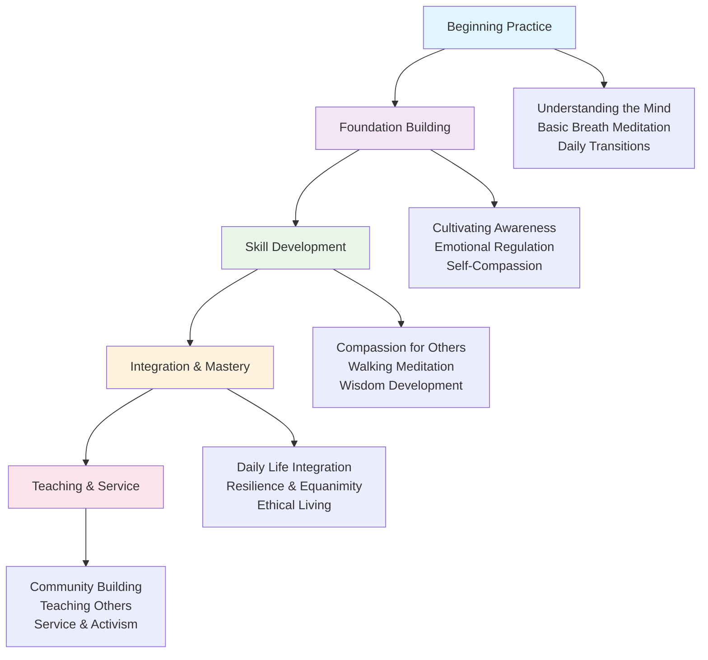
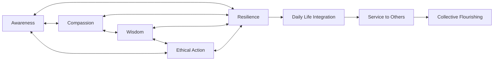

# The Open Path
*A Universal Framework for Mental Well-being and Human Flourishing*

## Introduction

The Open Path is the foundational module of the Global Flourishing Initiative—a comprehensive, evidence-based framework for cultivating mental well-being, emotional resilience, and wisdom. It represents a synthesis of contemplative traditions, modern psychology, and neuroscience, designed to be universally accessible and applicable across cultures and contexts.

This framework addresses the fundamental human experiences of suffering, seeking happiness, and the desire for meaning. It provides practical tools for developing awareness, compassion, wisdom, and resilience—qualities that form the foundation for both individual flourishing and our capacity to contribute to collective well-being.

## Framework Overview

```mermaid
graph TD
    A[The Open Path] --> B[Principles]
    A --> C[Practices]
    A --> D[Resources]

    B --> B1[Understanding the Mind]
    B --> B2[Cultivating Awareness]
    B --> B3[Developing Compassion]
    B --> B4[Understanding Interconnection]
    B --> B5[Cultivating Wisdom]
    B --> B6[Building Resilience]
    B --> B7[Understanding Suffering]
    B --> B8[Ethical Living]

    C --> C1[Foundational Meditations]
    C --> C2[Emotional Regulation]
    C --> C3[Compassion Meditations]
    C --> C4[Walking & Movement]
    C --> C5[Daily Life Integration]

    D --> D1[Scientific Research]
    D --> D2[Reading Lists]
    D --> D3[Visual Aids]
    D --> D4[Practice Tools]
    D --> D5[Community Resources]
```

## Core Philosophy

The Open Path is based on several key understandings:

1. **Inner Cultivation**: Lasting well-being comes from cultivating qualities of mind and heart rather than from external circumstances alone.

2. **Universal Capacity**: Every human being has the innate capacity for awareness, compassion, and wisdom.

3. **Practice-Based**: These qualities can be systematically developed through regular practice and application in daily life.

4. **Interconnection**: Individual well-being and collective well-being are deeply interconnected.

5. **Accessibility**: The path to inner development should be open and available to all, regardless of background, belief system, or life circumstances.

## How to Use This Module

The Open Path module is organized into three main sections:

### 1. Principles

The Principles directory contains foundational concepts and understandings about the nature of mind, emotions, and human experience. These documents explain the "why" behind the practices and provide a conceptual framework for your journey.

Key documents include:
- [Understanding the Mind](Principles/01_UnderstandingTheMind.md) - Foundation concepts about consciousness and mental patterns
- [Cultivating Awareness](Principles/02_CultivatingAwareness.md) - Developing present-moment awareness and mindfulness
- [Developing Compassion](Principles/03_DevelopingCompassion.md) - Cultivating loving-kindness and care for all beings
- [Understanding Interconnection](Principles/04_UnderstandingInterconnection.md) - Recognizing our fundamental interdependence
- [Cultivating Wisdom](Principles/05_CultivatingWisdom.md) - Developing discernment and wise decision-making
- [Building Resilience](Principles/06_BuildingResilience.md) - Developing equanimity and emotional stability
- [Understanding Suffering](Principles/07_UnderstandingSuffering.md) - The nature of suffering and path to liberation
- [Ethical Living](Principles/08_EthicalLiving.md) - Principles for beneficial action and right conduct

### 2. Practices

The Practices directory offers concrete techniques and exercises that you can implement in your daily life. These range from formal meditation practices to informal exercises that can be integrated into everyday activities.

Key documents include:
- [Foundational Meditations](Practices/01_FoundationalMeditations.md) - Core meditation techniques for developing awareness
- [Emotional Regulation Exercises](Practices/02_EmotionalRegulationExercises.md) - Practical tools for working with emotions
- [Compassion Meditations](Practices/03_CompassionMeditations.md) - Loving-kindness and compassion cultivation practices
- [Walking and Movement Meditations](Practices/04_WalkingMovementMeditations.md) - Dynamic meditation and mindful movement
- [Daily Life Integration](Practices/05_DailyLifeIntegration.md) - Bringing practice into everyday activities

### 3. Resources

The [Resources](Resources/README.md) directory provides comprehensive supplementary materials, including:
- [Scientific Research](Resources/01_ScientificResearch.md) - Peer-reviewed studies supporting contemplative practices
- Recommended Reading - Curated books and articles from wisdom traditions *(Coming Soon)*
- Visual Aids - Diagrams, flowcharts, and visual learning tools *(Coming Soon)*
- Audio Guidance - References to guided meditations and teachings *(Coming Soon)*
- Practice Tools - Templates, schedules, and progress tracking aids *(Coming Soon)*
- Community Resources - Guidelines for group practice and teaching *(Coming Soon)*
- Troubleshooting Guide - Solutions to common practice challenges *(Coming Soon)*
- Cultural Adaptations - Guidance for diverse cultural contexts *(Coming Soon)*

### 4. Translations

The Translations directory contains versions of The Open Path materials in different languages, making these teachings accessible to a global audience.

## Suggested Learning Paths

### For Complete Beginners

1. **Foundation**: Start with [Understanding the Mind](Principles/01_UnderstandingTheMind.md) to establish basic concepts
2. **First Practice**: Begin with [Foundational Meditations](Practices/01_FoundationalMeditations.md), starting with breath awareness
3. **Daily Integration**: Explore [Daily Life Integration](Practices/05_DailyLifeIntegration.md) for simple everyday practices
4. **Support**: Use the [Resources](Resources/README.md) to establish a routine and find additional tools
5. **Troubleshooting**: Refer to the practice documents for guidance on common challenges

### For Developing Practitioners

1. **Deepen Understanding**: Study [Cultivating Awareness](Principles/02_CultivatingAwareness.md) and [Developing Compassion](Principles/03_DevelopingCompassion.md)
2. **Expand Practice**: Add [Compassion Meditations](Practices/03_CompassionMeditations.md) and [Walking Meditations](Practices/04_WalkingMovementMeditations.md)
3. **Emotional Skills**: Work with [Emotional Regulation Exercises](Practices/02_EmotionalRegulationExercises.md)
4. **Community**: Explore the [Resources](Resources/README.md) directory for group practice guidance
5. **Study**: Dive into [Scientific Research](Resources/01_ScientificResearch.md) and additional reading materials

### For Advanced Practitioners and Teachers

1. **Complete Study**: Read all principle documents to develop comprehensive understanding
2. **Integration**: Master [Daily Life Integration](Practices/05_DailyLifeIntegration.md) practices
3. **Wisdom Development**: Focus on [Cultivating Wisdom](Principles/05_CultivatingWisdom.md) and [Ethical Living](Principles/08_EthicalLiving.md)
4. **Teaching Preparation**: Study the [Resources](Resources/README.md) for cultural adaptations and community guidelines
5. **Ongoing Learning**: Engage with the broader wisdom literature and research

### Universal Guidelines

- **Start Small**: Begin with 5-10 minutes of daily practice rather than ambitious goals
- **Consistency**: Regular practice is more valuable than occasional long sessions
- **Patience**: Allow understanding and capacity to develop gradually over time
- **Curiosity**: Approach with openness rather than striving for specific outcomes
- **Community**: Connect with others on similar journeys when possible

## Practice Development Journey

## The Interconnected Nature of Practice

## Connection to Other Modules

The Open Path serves as the foundation for all other modules in the Global Flourishing Initiative:

- The inner awareness and resilience developed here supports the nurturing presence needed in [The Flourishing Start](../01_TheFlourishingStart/README.md).
- The compassion and interconnection cultivated in these practices naturally extends to care for our [Ecological Integrity](../02_EcologicalIntegrity/README.md).
- The clarity and wisdom developed through these practices enhances our ability to create systems that ensure [Universal Basic Needs](../03_UniversalBasicNeeds/README.md) for all.
- The emotional regulation and well-being fostered here contributes to [Global Health](../04_GlobalHealth_DiseaseEradication/README.md).
- The inner peace and compassionate understanding cultivated in these practices forms the foundation for [Global Peace and Cooperation](../05_GlobalPeace_Cooperation/README.md).

## Contributing

We welcome contributions to The Open Path module. If you have suggestions for additional principles, practices, or resources, please see our [Contributing Guidelines](../../CONTRIBUTING.md).

---

*"The journey of a thousand miles begins with a single step." — Lao Tzu*
