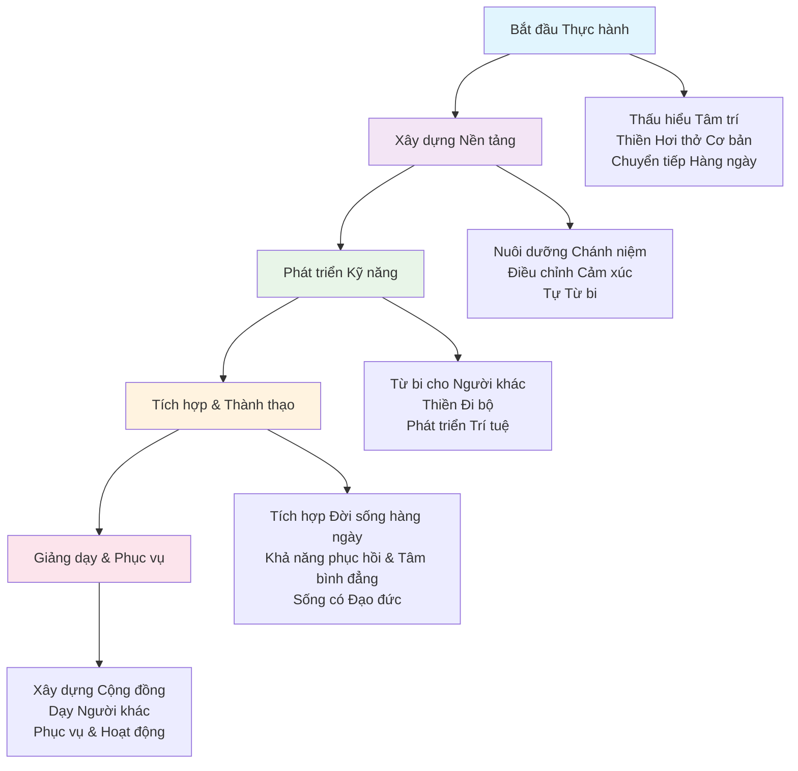
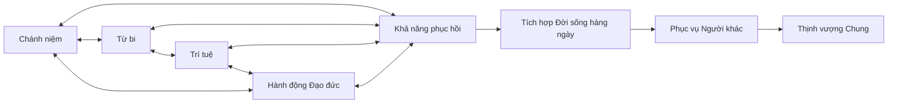

# Con Đường Mở
*Một Khung Thống Nhất cho Sức Khỏe Tâm Thần và Sự Thịnh Vượng của Con Người*

## Giới thiệu

Con Đường Mở là mô-đun nền tảng của Sáng Kiến Thịnh Vượng Toàn Cầu—một khung làm việc toàn diện, dựa trên bằng chứng để nuôi dưỡng sức khỏe tâm thần, khả năng phục hồi cảm xúc và trí tuệ. Nó thể hiện sự tổng hợp của các truyền thống thiền quán, tâm lý học hiện đại và khoa học thần kinh, được thiết kế để có thể tiếp cận và áp dụng phổ quát qua các nền văn hóa và bối cảnh.

Khung này giải quyết những trải nghiệm cơ bản của con người về khổ đau, tìm kiếm hạnh phúc và khao khát ý nghĩa. Nó cung cấp các công cụ thực tiễn để phát triển nhận thức, lòng từ bi, trí tuệ và khả năng phục hồi—những phẩm chất tạo nên nền tảng cho cả sự thịnh vượng cá nhân và khả năng đóng góp vào phúc lợi chung.

## Tổng quan Khung làm việc

```mermaid
graph TD
    A[Con Đường Mở] --> B[Nguyên tắc]
    A --> C[Thực hành]
    A --> D[Tài liệu]

    B --> B1[Thấu hiểu Tâm trí]
    B --> B2[Nuôi dưỡng Chánh niệm]
    B --> B3[Phát triển Lòng từ bi]
    B --> B4[Thấu hiểu Sự tương liên]
    B --> B5[Nuôi dưỡng Trí tuệ]
    B --> B6[Xây dựng Khả năng phục hồi]
    B --> B7[Thấu hiểu Khổ đau]
    B --> B8[Sống có Đạo đức]

    C --> C1[Thiền tập Nền tảng]
    C --> C2[Điều chỉnh Cảm xúc]
    C --> C3[Thiền Từ bi]
    C --> C4[Đi bộ & Chuyển động]
    C --> C5[Tích hợp Đời sống hàng ngày]

    D --> D1[Nghiên cứu Khoa học]
    D --> D2[Danh sách Đọc]
    D --> D3[Hỗ trợ Trực quan]
    D --> D4[Công cụ Thực hành]
    D --> D5[Tài liệu Cộng đồng]
```

## Triết lý Cốt lõi

Con Đường Mở dựa trên một số hiểu biết quan trọng:

1. **Tu tập Nội tâm**: Sự an lạc lâu dài đến từ việc nuôi dưỡng các phẩm chất của tâm và trái tim hơn là chỉ từ các hoàn cảnh bên ngoài.

2. **Khả năng Phổ quát**: Mỗi con người đều có khả năng bẩm sinh về nhận thức, lòng từ bi và trí tuệ.

3. **Dựa trên Thực hành**: Những phẩm chất này có thể được phát triển một cách có hệ thống thông qua việc thực hành đều đặn và áp dụng trong đời sống hàng ngày.

4. **Sự tương liên**: Sự an lạc cá nhân và phúc lợi chung có mối liên hệ sâu sắc với nhau.

5. **Khả năng tiếp cận**: Con đường phát triển nội tâm nên được mở ra và có sẵn cho tất cả, không phân biệt xuất thân, hệ thống niềm tin hay hoàn cảnh sống.

## Cách Sử dụng Mô-đun này

Mô-đun Con Đường Mở được tổ chức thành ba phần chính:

### 1. Nguyên tắc

Thư mục Nguyên tắc chứa các khái niệm và hiểu biết nền tảng về bản chất của tâm, cảm xúc và trải nghiệm con người. Những tài liệu này giải thích "tại sao" đằng sau các thực hành và cung cấp một khung khái niệm cho hành trình của bạn.

Các tài liệu quan trọng bao gồm:
- [Thấu hiểu Tâm trí](Principles/01_UnderstandingTheMind.md) - Các khái niệm nền tảng về ý thức và các mẫu hình tâm thần
- [Nuôi dưỡng Chánh niệm](Principles/02_CultivatingAwareness.md) - Phát triển nhận thức hiện tại và chánh niệm
- [Phát triển Lòng từ bi](Principles/03_DevelopingCompassion.md) - Nuôi dưỡng tình thương và sự quan tâm đến tất cả chúng sinh
- [Thấu hiểu Sự tương liên](Principles/04_UnderstandingInterconnection.md) - Nhận ra sự phụ thuộc lẫn nhau cơ bản của chúng ta
- [Nuôi dưỡng Trí tuệ](Principles/05_CultivatingWisdom.md) - Phát triển sự phân biệt và ra quyết định khôn ngoan
- [Xây dựng Khả năng phục hồi](Principles/06_BuildingResilience.md) - Phát triển tâm bình đẳng và sự ổn định cảm xúc
- [Thấu hiểu Khổ đau](Principles/07_UnderstandingSuffering.md) - Bản chất của khổ đau và con đường giải thoát
- [Sống có Đạo đức](Principles/08_EthicalLiving.md) - Nguyên tắc cho hành động có lợi và cách cư xử đúng đắn

### 2. Thực hành

Thư mục Thực hành cung cấp các kỹ thuật và bài tập cụ thể mà bạn có thể thực hiện trong đời sống hàng ngày. Chúng bao gồm từ các thực hành thiền tập chính thức đến các bài tập không chính thức có thể được tích hợp vào các hoạt động hàng ngày.

Các tài liệu quan trọng bao gồm:
- [Thiền tập Nền tảng](Practices/01_FoundationalMeditations.md) - Các kỹ thuật thiền cốt lõi để phát triển nhận thức
- [Bài tập Điều chỉnh Cảm xúc](Practices/02_EmotionalRegulationExercises.md) - Công cụ thực tiễn để làm việc với cảm xúc
- [Thiền Từ bi](Practices/03_CompassionMeditations.md) - Các thực hành nuôi dưỡng tình thương và lòng từ bi
- [Thiền Đi bộ và Chuyển động](Practices/04_WalkingMovementMeditations.md) - Thiền động và chuyển động chánh niệm
- [Tích hợp Đời sống hàng ngày](Practices/05_DailyLifeIntegration.md) - Đưa thực hành vào các hoạt động hàng ngày

### 3. Tài liệu

Thư mục [Tài liệu](Resources/README.md) cung cấp các tài liệu bổ sung toàn diện, bao gồm:
- [Nghiên cứu Khoa học](Resources/01_ScientificResearch.md) - Các nghiên cứu được đánh giá đồng đẳng hỗ trợ các thực hành thiền quán
- Đọc được Khuyến nghị - Sách và bài viết được tuyển chọn từ các truyền thống trí tuệ *(Sẽ ra mắt)*
- Hỗ trợ Trực quan - Sơ đồ, biểu đồ luồng và công cụ học tập trực quan *(Sẽ ra mắt)*
- Hướng dẫn Âm thanh - Tham khảo đến các thiền hướng dẫn và giảng dạy *(Sẽ ra mắt)*
- Công cụ Thực hành - Mẫu, lịch trình và công cụ theo dõi tiến độ *(Sẽ ra mắt)*
- Tài liệu Cộng đồng - Hướng dẫn cho thực hành nhóm và giảng dạy *(Sẽ ra mắt)*
- Hướng dẫn Khắc phục Sự cố - Giải pháp cho các thách thức thực hành thường gặp *(Sẽ ra mắt)*
- Điều chỉnh Văn hóa - Hướng dẫn cho các bối cảnh văn hóa đa dạng *(Sẽ ra mắt)*

### 4. Bản dịch

Thư mục Bản dịch chứa các phiên bản của tài liệu Con Đường Mở bằng các ngôn ngữ khác nhau, làm cho những giảng dạy này có thể tiếp cận được với đối tượng toàn cầu.

## Các Lộ trình Học tập được Đề xuất

### Cho Người mới bắt đầu Hoàn toàn

1. **Nền tảng**: Bắt đầu với [Thấu hiểu Tâm trí](Principles/01_UnderstandingTheMind.md) để thiết lập các khái niệm cơ bản
2. **Thực hành Đầu tiên**: Bắt đầu với [Thiền tập Nền tảng](Practices/01_FoundationalMeditations.md), bắt đầu với nhận thức hơi thở
3. **Tích hợp Hàng ngày**: Khám phá [Tích hợp Đời sống hàng ngày](Practices/05_DailyLifeIntegration.md) cho các thực hành hàng ngày đơn giản
4. **Hỗ trợ**: Sử dụng [Tài liệu](Resources/README.md) để thiết lập thói quen và tìm các công cụ bổ sung
5. **Khắc phục Sự cố**: Tham khảo các tài liệu thực hành để được hướng dẫn về các thách thức thường gặp

### Cho Người thực hành đang Phát triển

1. **Hiểu biết Sâu hơn**: Nghiên cứu [Nuôi dưỡng Chánh niệm](Principles/02_CultivatingAwareness.md) và [Phát triển Lòng từ bi](Principles/03_DevelopingCompassion.md)
2. **Mở rộng Thực hành**: Thêm [Thiền Từ bi](Practices/03_CompassionMeditations.md) và [Thiền Đi bộ](Practices/04_WalkingMovementMeditations.md)
3. **Kỹ năng Cảm xúc**: Làm việc với [Bài tập Điều chỉnh Cảm xúc](Practices/02_EmotionalRegulationExercises.md)
4. **Cộng đồng**: Khám phá thư mục [Tài liệu](Resources/README.md) để được hướng dẫn thực hành nhóm
5. **Học tập**: Tìm hiểu sâu về [Nghiên cứu Khoa học](Resources/01_ScientificResearch.md) và tài liệu đọc thêm

### Cho Người thực hành Nâng cao và Giáo viên

1. **Học tập Hoàn chỉnh**: Đọc tất cả tài liệu nguyên tắc để phát triển hiểu biết toàn diện
2. **Tích hợp**: Thành thạo các thực hành [Tích hợp Đời sống hàng ngày](Practices/05_DailyLifeIntegration.md)
3. **Phát triển Trí tuệ**: Tập trung vào [Nuôi dưỡng Trí tuệ](Principles/05_CultivatingWisdom.md) và [Sống có Đạo đức](Principles/08_EthicalLiving.md)
4. **Chuẩn bị Giảng dạy**: Nghiên cứu [Tài liệu](Resources/README.md) cho điều chỉnh văn hóa và hướng dẫn cộng đồng
5. **Học tập Liên tục**: Tham gia với văn học trí tuệ rộng lớn hơn và nghiên cứu

### Hướng dẫn Phổ quát

- **Bắt đầu Nhỏ**: Bắt đầu với 5-10 phút thực hành hàng ngày thay vì các mục tiêu tham vọng
- **Nhất quán**: Thực hành đều đặn có giá trị hơn các phiên dài thỉnh thoảng
- **Kiên nhẫn**: Cho phép hiểu biết và khả năng phát triển dần dần theo thời gian
- **Tò mò**: Tiếp cận với sự cởi mở thay vì phấn đấu cho kết quả cụ thể
- **Cộng đồng**: Kết nối với những người khác trên hành trình tương tự khi có thể

## Hành trình Phát triển Thực hành

## Bản chất Tương liên của Thực hành

## Kết nối với Các Mô-đun Khác

Con Đường Mở phục vụ như nền tảng cho tất cả các mô-đun khác trong Sáng Kiến Thịnh Vượng Toàn Cầu:

- Nhận thức nội tâm và khả năng phục hồi được phát triển ở đây hỗ trợ sự hiện diện nuôi dưỡng cần thiết trong [Khởi Đầu Thịnh Vượng](../01_KhởiĐầuThịnhVượng/README.md).
- Lòng từ bi và sự tương liên được nuôi dưỡng trong những thực hành này tự nhiên mở rộng đến việc chăm sóc [Tính Toàn Vẹn Sinh Thái](../02_TínhToànVẹnSinhThái/README.md) của chúng ta.
- Sự rõ ràng và trí tuệ được phát triển thông qua những thực hành này nâng cao khả năng tạo ra các hệ thống đảm bảo [Nhu Cầu Cơ Bản Toàn Cầu](../03_NhuCầuCơBảnToànCầu/README.md) cho tất cả.
- Việc điều chỉnh cảm xúc và sự an lạc được nuôi dưỡng ở đây đóng góp vào [Sức Khỏe Toàn Cầu](../04_SứcKhỏeToànCầu_XóaBỏDịchBệnh/README.md).
- Sự bình an nội tâm và hiểu biết từ bi được nuôi dưỡng trong những thực hành này tạo nền tảng cho [Hòa Bình Toàn Cầu và Hợp Tác](../05_HòaBìnhToànCầu_HợpTác/README.md).

## Đóng góp

Chúng tôi hoan nghênh các đóng góp cho mô-đun Con Đường Mở. Nếu bạn có đề xuất cho các nguyên tắc, thực hành hoặc tài liệu bổ sung, vui lòng xem [Hướng Dẫn Đóng Góp](../../CONTRIBUTING.md) của chúng tôi.

---

*"Hành trình ngàn dặm bắt đầu bằng một bước chân." — Lão Tử*
